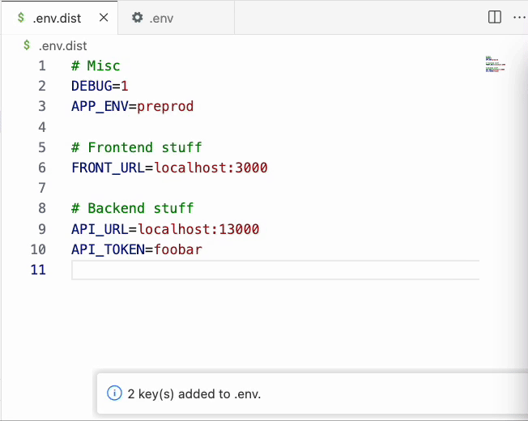
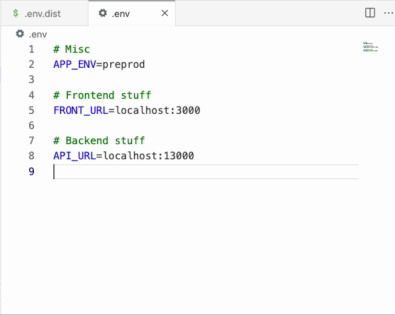

# 🧪 Smart Env Paste

Paste only missing `.env` keys from clipboard into your current `.env` file.

- ✅ Avoid duplicates
- ⚡ Fast, smart, and context-aware
- 🎯 Works with `.env`, `.env.production`, `.env.custom`, etc.

## 🚀 Features

- Smart paste from `.env.dist`
- Only adds missing keys
- Configurable file matching pattern
- Works via shortcut (`Cmd+Shift+V`) or right-click menu

## ⚙️ Settings

| Setting                     | Default             | Description              |
| --------------------------- | ------------------- | ------------------------ |
| `smartEnvPaste.filePattern` | `^\\.env(\\.\\w+)?` | Regex for matching files |

## 📸 Demo

## ⌨️ Keyboard Shortcut

`Cmd+Shift+V` in matching files.

## 📂 File Support Examples

- `.env`
- `.env.local`
- `.env.production`
